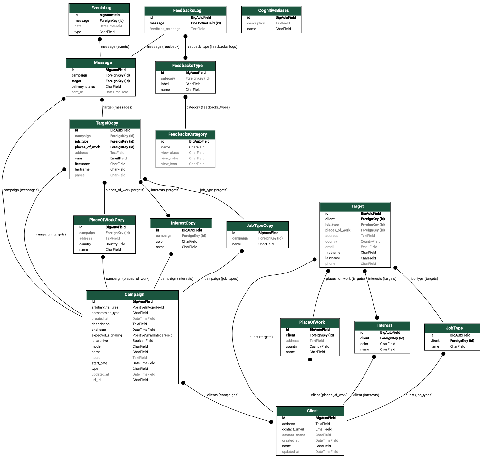

> 🚧 This application is currently **under development** and not ready for production.
  
> ⚠️ The project was originally coded in pure Python Django. The Django REST Framework module and the Nuxt.js frontend application were added later. However, for skills demonstration purposes only, the Django templates and all associated code were left in the project.

# SOS Phishing — Phishing Campaign Analysis Platform

**SOS Phishing** is a web application currently *under development*. It is designed to **launch, monitor, and analyze phishing campaigns** for educational purposes and cybersecurity awareness.

The project aims to deliver a full-featured tool to:
- **Create and configure phishing campaigns**
- **Collect relevant data**
- **Visualize results through an interactive dashboard**

> 💡 Built with a modern fullstack architecture (Nuxt 3 + Django REST), the app must focuses on security, clean code structure, and reusable components.

---

## 🚀 Implemented Features

✅ **Secure authentication** with full JWT + refresh token management  
✅ **Dashboard view** for campaign monitoring and results

🎥 Feature previews:
- Authentication + campaign creation:   
- Campaign dashboard: 

---

## 🖥️ Frontend — [Nuxt 3, PrimeVue]

The frontend is built with **Nuxt 3**, using a composable and modular architecture.

### 🔐 Full JavaScript Authentication
- Automatic refresh of **JWT + refresh tokens**
- Login/logout flows with protected routing and redirect logic

### 🔄 Middleware & Access Control
- Nuxt middleware used to:
  - Protect sensitive routes
  - Automatically redirect users based on auth status
  - Centralize access control logic

### 🧩 API Communication & Composables
- Custom Nuxt composables (`useAuth`)
- Centralized API call handling with error catching and loading indicators

### 📱 Responsive UI & Custom Design
- Responsive layout using **PrimeVue** (JS components, layout) and **PrimeFlex** (CSS framework)
- **Custom sidebar** (CSS + native JS) with dynamic behavior
- Light theming with clear component/view separation

---

## 🛠️ Backend — [Django + Django REST Framework]

The backend is powered by **Django** and a structured, secure **REST API**.

### 🧱 Architecture
- REST API built with **Django REST Framework**
- Data access via **Django ORM** with **custom model managers**
- Clean data serialization using DRF serializers

### 🔐 Security & Authentication
- JWT-based authentication (using `djangorestframework-simplejwt`)
- DRF permission classes for endpoint protection and role control

### 📊 Database & Data Models
- Relational schema tailored to phishing campaigns (users, campaigns, stats)
- Business logic embedded in model methods and managers

---

## 📚 Development Status

**SOS Phishing** is actively in development. Planned features include:

- [ ] Phishing email delivery (SMTP integration and mock service for testing purposes)
- [ ] Additionnal user interaction stats
- [ ] CSV/PDF export for campaigns and users
- [ ] Multi-user and role-based access control

---

## ⚙️ Tech Stack

| Frontend             | Backend              | DevOps / Tools              |
|----------------------|----------------------|-----------------------------|
| Nuxt 3               | Django 4             | Git / GitHub                |
| PrimeVue             | Django REST Framework| Docker                      |
| PrimeFlex            | PostgreSQL           | JWT Auth                    |
|                      | Django ORM + Managers| Custom middleware, composables |

---

## Database

Here is the class diagram of the shared_models application:

## 💬 Why This Project?

This project was created with two goals in mind:

1. **Deepen expertise** with modern fullstack technologies (Nuxt 3, Django REST)
2. **Build a useful, real-world cybersecurity tool** for education and awareness

## 🧑‍🔬 Contribute

This repository does not yet accept merge requests and exists for now for skills demonstration purposes only.
